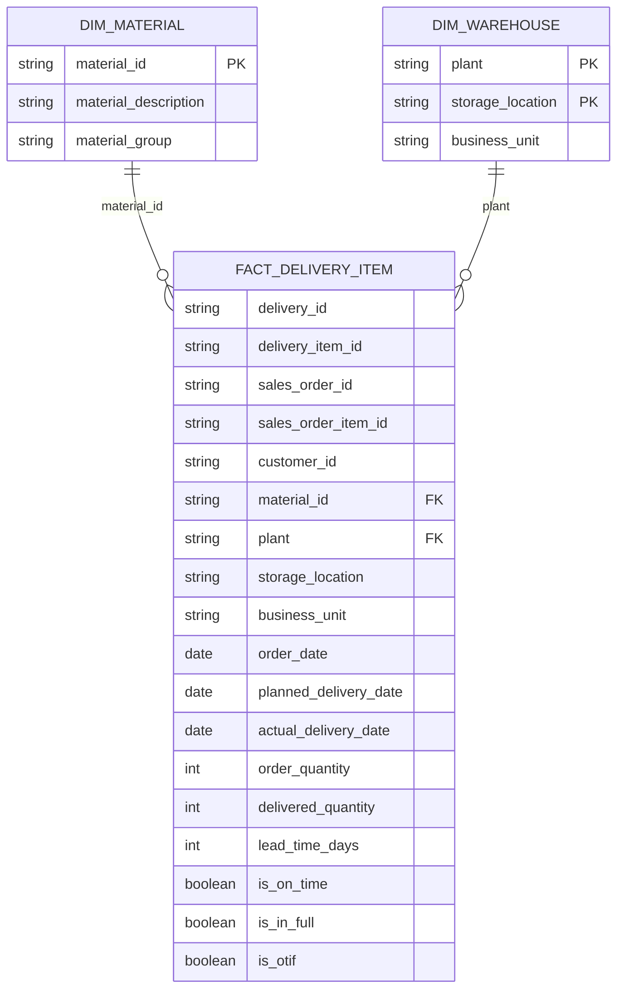
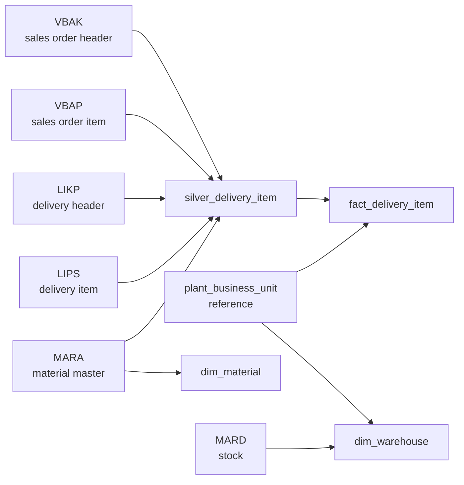

# ERD — Gold Layer Dimensional Model

## Purpose
Shows the resulting star schema after `notebooks/03_gold_transformation.py`,
alongside the source tables each gold table derives from. Field-for-field mapping
and transformation rules are in `docs/mapping-spec.md`; formulas for the
calculated fields are in `docs/kpi-definitions.md`.

## Star schema

**Grain:** `fact_delivery_item` = 1 row per delivery item (LIPS line). No
`dim_customer` or `dim_date` — the mapping spec doesn't define a customer master
or calendar dimension in scope for this project; `customer_id` and the three date
fields are carried as degenerate attributes on the fact table.

## Source → gold lineage

Bronze and silver layer table-by-table detail: `docs/data-dictionary.md`.
